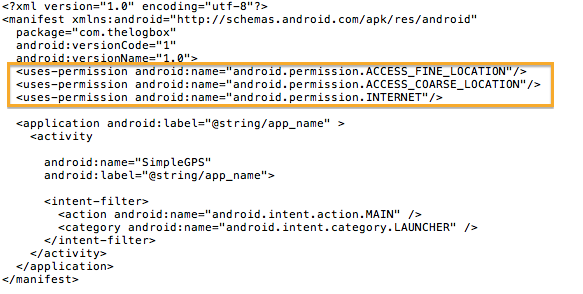

There are three things you need to do in order to do some location API joojoo on android. These are;

1. Allow the use Location based service on the device. The user has to do this,  there is no way to enable the service programatically
2. Add permissions on the Manifest file
3. Use the LocationManager and other related classes on the android.location.* package

### 1. Allow the use of Location-based service

On the device.

1. Go to settings
2. Go to Location and Security
3. Choose the appropriate settings (use wireless networks and/or use gps sattelites)

### 2. Changes on the manifest file are highlighted

### 3.  The code for Location-based API



/*

 BSD License: Copyright (c) 2009-2012 Ted Hagos
 All rights reserved.

 License text: http://thelogbox.com/source-docs/software-license.txt

*/

package com.thelogbox;

import android.app.Activity;
import android.os.Bundle;
import android.widget.LinearLayout;
import android.widget.TextView;
import android.content.Context;
import android.view.View;
import android.view.View.OnClickListener;
import java.util.List;
import android.location.LocationManager;
import android.location.LocationListener;
import android.location.Location;
import android.location.Criteria;
import android.location.Geocoder;
import android.location.Address;
import android.util.Log;

class GPSView extends LinearLayout implements OnClickListener, LocationListener {

  Context ctx = null;
  TextView tv = null;
  String TAG = null;
  LocationManager locm = null;
  Location loc = null;
  Geocoder geo = null;
  List address = null;
  Address addr = null;

  public GPSView(Context ctx) {
    super(ctx);
    tv = new TextView(ctx);
    this.ctx = ctx;
    TAG = getClass().getName();

    setOnClickListener(this);

    addView(tv);
  }

  public void onClick(View v) {

    locm = (LocationManager) ctx.getSystemService(ctx.LOCATION_SERVICE);
    loc = locm.getLastKnownLocation(locm.getBestProvider(new Criteria(),false));
    geo = new Geocoder(ctx);

    Log.v(TAG, "Got Location");
    String msg = tv.getText().toString();

    if (loc != null) {

      double lon = loc.getLongitude();
      double lat = loc.getLatitude();
      try {
        address = geo.getFromLocation(lat, lon, 1);
      }
      catch(Exception e){
        Log.v(TAG, e.getMessage());
      }
      addr = address.get(0);

      Log.v(TAG, "got Lat and Lon and geocode");

      msg += "\n";
      msg += "LAT: ";
      msg += String.valueOf(lat);
      msg += " | LON: ";
      msg += String.valueOf(lon);
      msg += " | Country:  ";
      msg += addr.getCountryName();
      msg += ", ";
      msg += addr.getLocality();
      msg += ", ";
      msg += addr.getPostalCode();
      msg += "| ";

      for (int i = 0; i < addr.getMaxAddressLineIndex(); i++) {
        msg +=  addr.getAddressLine(i) + " ";
      }

      tv.setText(msg);
    }
    else {
      Log.v(TAG, "No location");
      tv.setText("No Location");
    }
  }
  
  public void onLocationChanged(Location location) {
    Log.v(TAG, "location changed");
  }

  public void onStatusChanged(String provider, int status, Bundle bundle){
    Log.v(TAG, "status changed");
  }

  public void onProviderEnabled(String provider) {
    Log.v(TAG, provider + " is enabled");
  }

  public void onProviderDisabled(String provider) {
    Log.v(TAG, provider + "is disabled");
  }

}

public class SimpleGPS extends Activity {

    @Override
    public void onCreate(Bundle savedInstanceState) {
        super.onCreate(savedInstanceState);
        setContentView(new GPSView(this));
    }
}



1. Get an instance of a LocationManager object, this can be done by calling the getSystemService() method of the Application Context

2. Call the getLastKnownLocation() method of the location manager object to get a Location object

3. From the location object, you can extract the longitude and latitude information, both these methods will return a double data type. At this point, you already have latitude and longitude info---you can stop here if that is all you need. If on the other hand, you need to get a human readable address, like Country, Locality etc. Use the Geocoder class and do a reverse geocoding---continue to *step 4*

4. Create an instance of Geocoder

5. Call the getFromLocation(latitude, longitude, 1) of the geocoder object. The third parameter is the maximum number of results (addresses) that you wish to extract. In the example, we are only interested in 1 address, hence the third parameter is an an int value 1

6. getFromLocation() will return a java.util.List object, it will have only 1 element (because the third parameter that was passed instructed it to return only 1 value). Extract that element, it will be an android.location.Address object

7. Extract the members of the Address object to get the address lines, country name and locality. There are a lot more information on the address object, just look up the API if you need to extract more information

**NOTE:** The LocationListener interface is not necessary if you simply want to get the current GPS information on the device. You will need the the callbacks of the LocationListener if you want something to happen in response to the following;

- When the location has changed – onLocationChanged()
- When there is change on status of the GPS provider – onStatusChanged()
- When the GPS provider is disabled – onProviderDisabled()
- When the GPS provider is enabled – onProviderEnabled()

