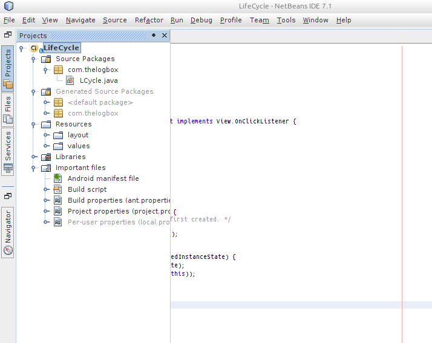
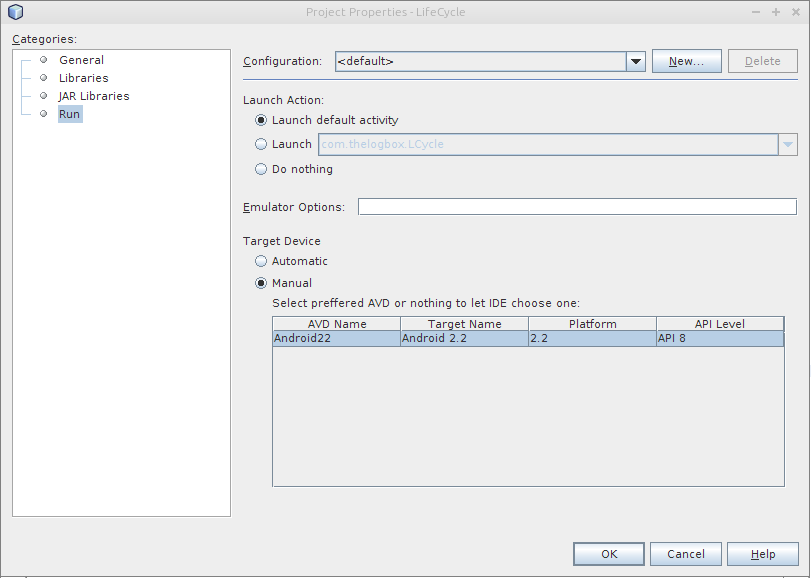

## Environment setup

Make sure you have already installed the ANDROID SDK and that you have properly configured the PATHs to tools and platform-tools. Make sure also that you have properly installed and configured Apache ANT.

Download Netbeans from [netbeans.org](http://netbeans.org), install it. The installation is straightforward, just follow the prompts. 

### Install the NBAndroid plugin

1. Open Netbeans, go to **Tools**
2. Go to **Plugins**
3. Go to **Settings**
4. Click **Add**
5. Put whatever you like on *Name* field, I suggest NBAndroid
6. Put http://kenai.com/projects/nbandroid/downloads/download/updatecenter/updates.xml on the URL. This URL might change in the future, when that happens, visit the [Kenai/NBAndroid/Wiki](http://kenai.com/projects/nbandroid/pages/Install), I'm sure they will do a better job of keeping URLs updated than I will
7. The **Android** option should now be visible from the *Available* plugins tab &mdash; if it does not show up, try to *reload the catalog*
8. Continue with the installation of the plugin
9. Go to **Tools** then **Options**, click the *Android* tab. Fill in the location of the folder (dir) where you installed the Android SDK. Click Ok when you're done
10. You will see the *android* option when you create a new project

## Creating a project

On the menu bar, click **File** &rarr; **New Project**, Choose *Android* then *Android Test project*. Fill in the project name, project location, set it as main project.

Fill up the package name. The package name is usually a reverse DNS notation of your domain, say *com.thelogbox*, it doesn't have to exist so you can put whatever you want. Fill up also the name of your main activity class. Think of an Activity class as the main(first) user interface that your users will see on your application. Click **Finish**

## Testing

Compile the project (Build project in netbeans). This is on the **Run** menu. When the build is successful, run the project (F11 is the key), this is also under the **Run** menu.

Netbeans will ask you to setup an AVD (Android Virtual Device), it is an emulator where you can run and test your Android projects. There are more instructions on how to create an manage AVDs on the [developer.android.com/devices] page.

## Testing with Physical Devices

There are two parts to testing the physical devices. First, you must have correctly setup the USB configuration of the Android physical device on your platform. The other part is how to tell Netbeans that you want to use the physical device instead of the AVD.

If you are using OSX, you don't have to do anything but to simply enable USB debugging on your physical device then plug it in.If you are using Windows or Linux for development, you need to read [how to setup a device for development](http://developer.android.com/tools/device.html) on the Android developer site.  

Netbeans automatically launches the configured AVD when you click **Run**, at least on Netbeans 7.1 that is how it behaved. In order to use the android physical device as a target of the build, you need to.

1. Open the Android project you just created
2. From the *Projects* tab, right click on the main android project
3. Choose *Properties* (there are some pictures below)
4. Choose the **Run** option (there are some pictures below)
5. The *Target Device* is setup to **Automatic**, you need to change that to **Manual** so that you can choose the physical device attached when you *Build/Run* your project

If you want to automatically deploy to the attached physical device *always*, then just remove all the AVD definitions on the *Android SDK and AVD manager*. After that, you can set the **Target Device** to Automatic on the Netbeans Run options

### Netbeans Project Properties

### Netbeans Project Properties::Run

# References

1. [developer.android.com/AVD](http://developer.android.com/tools/devices/managing-avds.html) - Managing AVDs. Google, 2013
2. [developer.android.com/tools/device](http://developer.android.com/tools/device.html) - Setting up USB devices for Android testing. Google, 2013

