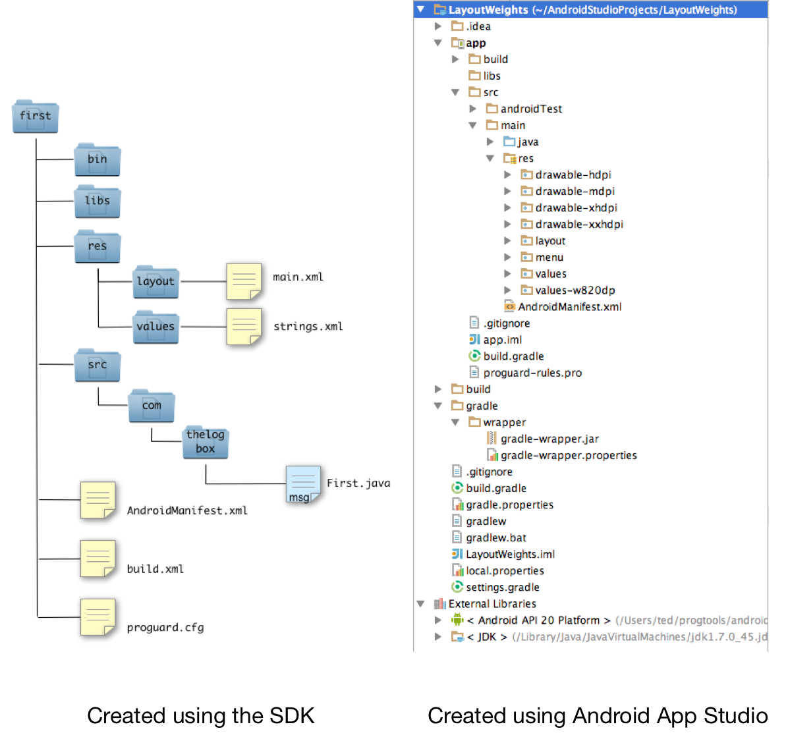

An Android project is required to build a single app. A project is a
simple folder that contains a collection of XML, Java source, images,
property and optional audio or video files. It has a very specific
structure that stays the same for all android projects.

The commands and utilities inside the Android SDK expects this structure
and is optimized to work with it. If you deviate from this structure,
you will have grief. It is not wise to build this project structure
unaided by tools. At the very least, you should use the **android create
project** utility included in the SDK.

Popular IDEs like Eclipse, NetBeans and Android Studio have wizard
driven ways of creating an android project. But no matter what you use
to create such a project, the structure of the files and folders is
pretty uniform.

The one on the left is a project created using just the SDK. The picture
on the right was created using the Android App Studio, a full blown IDE
for Android development. While the Android Studio project appears to
have more files, the basic structure of the two projects remains very
consistent.

- **src** a folder that contains the Java source files. All your program logic
    will be written on these files. If you want to do something when a
    user clicks a Button, starts you application or suspends an
    application, you will write them on the source files. And these
    source files will be stored here
- **res** a folder that contains other folders like "res", "values" and some
    images. The folder names that says "drawable" contains images that
    your application may use
- **bin** When you compile the project, this is where the binary or executable
    files will be stored
- **libs** Sometimes you will need to use codes that other developers built.
    These third party libraries should be located on this folder
- **layout** Android favors the declarative way of defining user interfaces. The
    screens you will create can be built using XML files. This is the
    folder where XML screen files are stored
- **values** Hard coding string values is a dangerous practice. The idiomatic way
    of defining strings for labels, buttons etc is to store them in
    resource bundles. These resource bundles are nothing more than XML
    files. You will store the resource bundles in this folder
- **AndroidManifest.xml** Every project needs one manifest file. This file is important. It
    declares the things that are inside your application like how many
    screens it have, what their names are. It also affects the things
    your application can do. It declares whether your application can
    use the network, the local storage or the camera for example
- **local.properties** This file contains build configuration information e.g. the location
    of the Android SDK in your system

