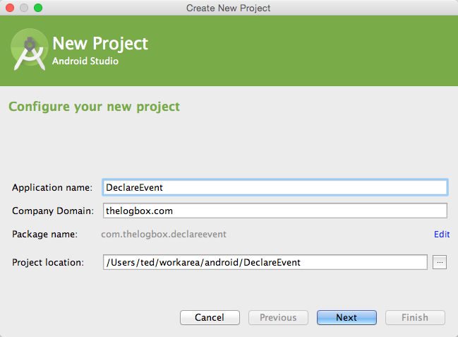
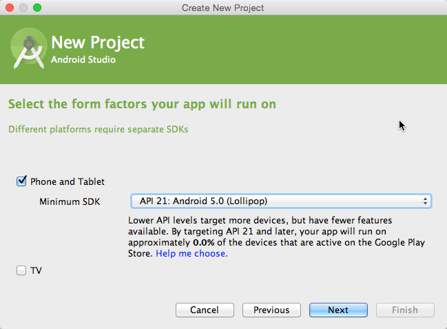
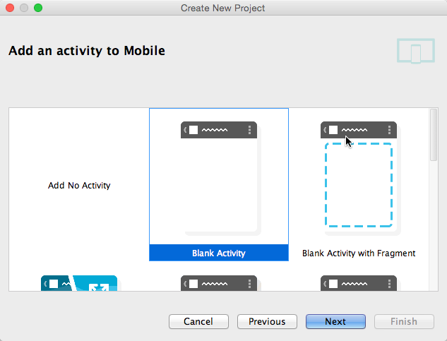
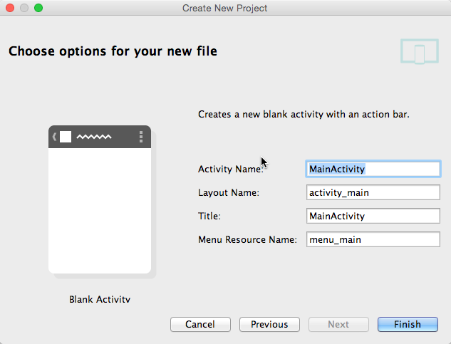
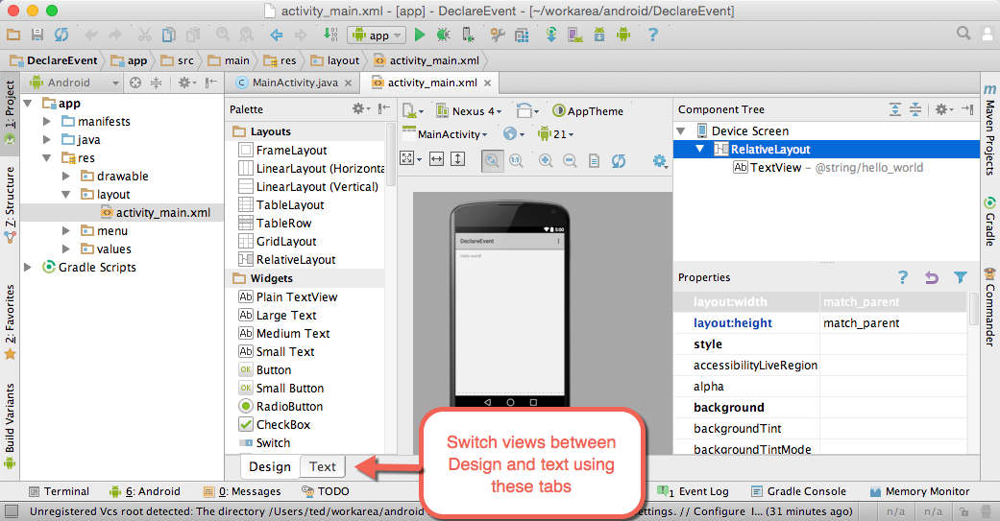
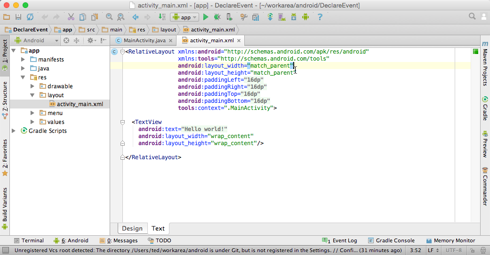

## 1 Prerequisite

Before proceeding to the lesson, you must have done the following

1. You need a properly installed Android Studio with API level 20 installed. We do not really need level 20 for this example so you can use a lower level API if that is what you've got
1. Anatomy of an android project
1. How to setup a project, either in CLI or Android Studio
2. Understand the lifecycle of an Activity
3. Understand Manifest XML, what is the entry point of an Android application
4. R.layout, the dynamically generated class of Android
5. Understand the constraints of the UI and the XML file
6. Basic IDE parts and operations
7. Emulator basics
8. Connecting a device

## 2 Basic Concept

When an application is launched, the android runtime inspects the AndroidManifest file. It looks an activity class which has been designated as the entry point. This activity class is then instantiated, goes through its life cycle and at some point, calls  one of its method, the **setContentView**, in order to render a user interface. This is the screen that the user sees when the application is launched. 

The setContentView is parametrically polymorphic. It has been overloaded so it can take on different types of data. It can take a View Object, in which case that means you must have defined your user interface programmatically. Or it can take an integer value, in which case it means you defined the user interface on an xml file. At the moment, we are interested in the latter. Our exercise  will define the user interface declaratively using an xml file.

A blank activity project that is created using the Android IDE gives us a bootstrapped collection of projects assets. The IDE automatically creates a java source file which serves as the main activity. The IDE also creates the AndroidManifest file and the xml file which the activity uses to render a user interface. 

The generated xml file that is used for UI (user interface) definition is very spartan. It only contains a TextView object. What we will do is to add a Button object to our UI definition. The Button will be equipped with the appropriate xml attribute so it can listen for user events. 

~~~
<Button
  android:layout_width="wrap_content"
  android:layout_height="wrap_content"
  android:text="Click Me"
  android:onClick="showMe"
  android:layout_below="@+id/textView"
  android:layout_alignParentStart="true"/>
~~~

Most of the attributes of the Button node has to do with the way it looks, how tall and wide it should be, what text will you see on the button's surface and where it should be positioned. In our case it is vertically aligned with its parent and horizontally positioned right below the TextView. The one attribute which is relevant to event handling is the **android:onClick** attribute

When the **onClick** attribute is present, the android runtime will look inside the activity class that is associated with this xml file for a method. The name of that method must match the value of  the **onClick** attribute.

The program logic that will kick in when the user clicks our Button will be inside the Activity class. The code for the **showMe** method is as follows.

~~~
  public void showMe(View v) {
    Context ctx = getApplicationContext();
    String msg = "Hello World";
    int duration = Toast.LENGTH_SHORT;
    Toast notification = Toast.makeText(ctx,msg,duration);
    notification.show();
  }
~~~

## 3 Steps

**1. Create a new project**. Supply the necessary information for the creation of a new project like Application name, Company domain and project location. The application name becomes the root folder the project. The company domain is transformed into reverse dns notation and becomes the namespace or the the package name for all the classes in the project.

**2. Select only the phone and tablet option** . We intend for this project to run on either a phone or tablet, so make sure that is selected. Leave out the TV option. The minimum SDK is not very important for this project, but I chose level 21 simply because I have it in my setup. You can choose a lower level API. We only need some very rudimentary capabilities for this project, even API level 8 will do.

**3. Choose a blank activity** for this project. We don't need a complex layout. The blank option will keep things simple for us

**4. Accept the default values** for Activity name, layout, title and menu resource name

**5. Click Finish** to create the project

The project will open with the activity_main.xml file rendered in **Design** view. The IDE allows you to work in either GUI mode where we can simply drag, drop, click and drag the UI components. It also allows us to work in text mode, which is simpler and faster, but maybe less intuitive. For now we will work on the text mode.

**6. Switch to text mode**. While the activity_main.xml file is still selected on the upper tabs of the IDE, find the tabs in the lower portion of screen. Click the **Text** tab. That will take you the raw xml view of the activity_main file. 

Once we switched to text mode, the raw xml is now exposed. It is very spartan. It only has one TextView object at moment. The code for our activity_main is shown below. 

**7. Add the Button** definition to the activity_main.xml file. The activity_main.xml file, as generated during the project creation process looks the code below.


<RelativeLayout xmlns:android="http://schemas.android.com/apk/res/android"
                xmlns:tools="http://schemas.android.com/tools"
                android:layout_width="match_parent"
                android:layout_height="match_parent"
                android:paddingLeft="@dimen/activity_horizontal_margin"
                android:paddingRight="@dimen/activity_horizontal_margin"
                android:paddingTop="@dimen/activity_vertical_margin"
                android:paddingBottom="@dimen/activity_vertical_margin"
                tools:context=".MainActivity">

  <TextView
    android:text="@string/hello_world"
    android:layout_width="wrap_content"
    android:layout_height="wrap_content"
    android:id="@+id/textView"/>
    
</RelativeLayout>


Insert the Button definition right below the closing tag of the TextView. Make sure that it is still enclosed within the RelativeLayout tag. 


<RelativeLayout xmlns:android="http://schemas.android.com/apk/res/android"
                xmlns:tools="http://schemas.android.com/tools"
                android:layout_width="match_parent"
                android:layout_height="match_parent"
                android:paddingLeft="@dimen/activity_horizontal_margin"
                android:paddingRight="@dimen/activity_horizontal_margin"
                android:paddingTop="@dimen/activity_vertical_margin"
                android:paddingBottom="@dimen/activity_vertical_margin"
                tools:context=".MainActivity">

  <TextView
    android:text="@string/hello_world"
    android:layout_width="wrap_content"
    android:layout_height="wrap_content"
    android:id="@+id/textView"/>

  <Button
    android:layout_width="wrap_content"
    android:layout_height="wrap_content"
    android:text="Click me okay"
    android:onClick="showMe"
    android:layout_below="@+id/textView"
    android:layout_alignParentStart="true"/>

</RelativeLayout>


The button definition is just another xml node. It was placed inside **RelativeLayout** which is the main node so that the Button becomes its child.

**8. Go to the tab of MainActivity.java** and write the code for the showMe method.


package com.thelogbox.declareevent;

import android.app.Activity;
import android.os.Bundle;
import android.view.Menu;
import android.view.MenuItem;
import android.view.View;
import android.widget.Toast;
import android.content.Context;

public class MainActivity extends Activity {

  //This method was created by the IDE
  @Override
  protected void onCreate(Bundle savedInstanceState) {
    super.onCreate(savedInstanceState);
    setContentView(R.layout.activity_main);
  }
  //This too was created by the IDE
  @Override
  public boolean onCreateOptionsMenu(Menu menu) {
    getMenuInflater().inflate(R.menu.menu_main, menu);
    return true;
  }
  //And so is this one too.
  @Override
  public boolean onOptionsItemSelected(MenuItem item) {
    int id = item.getItemId();
    if (id == R.id.action_settings) {
      return true;
    }
    return super.onOptionsItemSelected(item);
  }

  //This method we write on our own
  public void showMe(View v) {
    Context ctx = getApplicationContext();
    String msg = "Hello World";
    int duration = Toast.LENGTH_SHORT;
    Toast notification = Toast.makeText(ctx,msg,duration);
    notification.show();
  }

}


**9. Build the app and run Make**. 

**10. Run the project** using either an emulator or a connected Android device

## Glossary

1. **Parametrically Polymorphic**.	Overloaded method. The method has been defined more than once so it can deal with different kinds of parameter data
2. **Toast class**.	Toast is a view containing a quick little message to the user. If you have ever used the alert() function in Javascript or the MsgBox in Visual Basic, Toast is similar to those
3. **Android Studio Text Mode**. View an xml file in raw mode. You can see the text of the GUI definition in raw XML
4. **Android Studio Design mode**.	View an xml file in design mode. You can design a screen in graphical mode

Flash cards are at [Quizlet, TLB, declarative event handling](http://quizlet.com/_12k3my)

## 5 Further Reading

https://developer.android.com/training/basics/firstapp/building-ui.html

## 6 Resources

The source xml and java files for this exercise can be downloaded as a [zipped file](../resources/declarative-event-handling.zip) from the resources page

