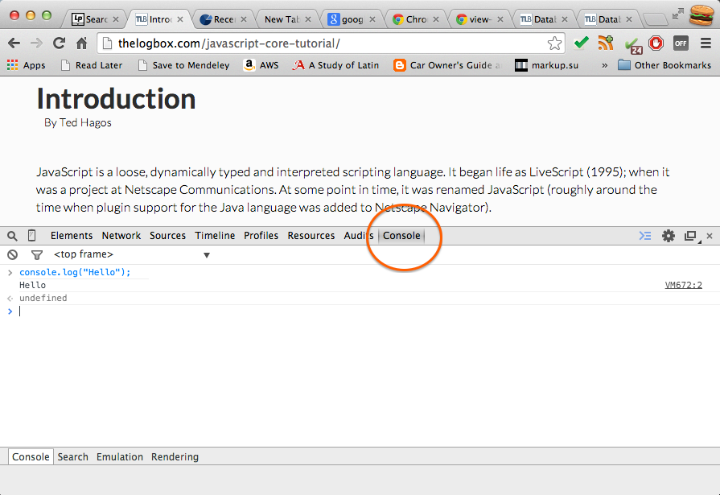

1 What is it
------------

JavaScript is a loose, dynamically typed and interpreted scripting
language. It began life as LiveScript (1995); when it was a project at
Netscape Communications. At some point in time, it was renamed
JavaScript (roughly around the time when plugin support for the Java
language was added to Netscape Navigator).

Java and JavaScript are not related to each other, not even remotely,
they simply share a commonality in their names.

JavaScript’s popularity maybe attributed to it’s ubiquity amongst web
pages (client side JavaScript), but it is actually being used in lots of
places other than web pages. JS can be ran on the server (Node.JS), it
can be used to do MVC type development of web apps (Backbone.JS) and it
can also be used to stitch together a bunch of Java apps together
(Rhino); these are just some of the other uses of JavaScript.

JavaScript as we know it today, is the scripting language consistent
with ECMAScript. ECMAScript is a standardized scripting language
according to ECMA specification 262 and ISO/IEC 16262. ECMAScript exist
in the form of JavaScript, ActionScript and JScript. If you are looking
for language specification of JavaScript, you can look at the ECMAScript
262^[1](#fn.1)^.

2 A bit of history
------------------

### 2.1 Origins

### 2.2 About the name

3 Minimum tooling
-----------------

It is not difficult to get started with JavaScript. The necessary tools
you need to try out and play around with the language are most likely
already in your notebook or desktop computer. You only need a modern web
browser and not much else.

Most modern browsers like Chrome, Firefox, Safari and IE include the
JavaScript runtime, some diagnostic tools and even an interactive
JavaScript environment. You can use the interactive environment to try
out expressions and statements. It's a programmer's playground.

You can use your preferred browser to try out the exercises, but if you
want to follow the coding examples closely, please use the latest Google
Chrome browser. That's what I'll be using for the examples.

### 3.1 The JavaScript console

The Chrome browser includes a set of developer tools. These tools are
used for authoring web pages and debugging. This is what we will use to
take our first steps towards JavaScript programming.

Launch a Chrome browser session if you haven't done so already. You are
probably looking at your home page or a default page of Chrome. There
are two ways to get to the developer tools. You can select the Chrome
menu (the symbol that has three horizontal lines at the top-right of the
browser), then select **Tools** \> **Developer Tools**.

Anoter way to launch the dev tools is to right click on any part of the
web page. Then from the context menu choose the options **Inspect
Elements**.

The developer tools is organized into tabs. The tab you need to get to
is the **Console**. Click that tab to access the interactive JavaScript
environment.

The Console is a REPL environment. REPL means Read, Eval, Print, Loop.
You can type valid JavaScript expressions, statements and even function
definitions in the Console and it will **Read** what you typed, then
**Evaluate** it. After that it will *Print* the result of the evaluation
and then it will wait for you to type something up again. Lather, rinse,
repeat.

The Console is a good place to start when you are beginning to learn
JavaScript. It is a valuable tool not only for learning for debugging.
Some seasoned programmers continue to use the console for quick
investigations and debugging sessions. These are good reasons why you
might want to invest some time learning this tool.

Click anywhere inside the Console area. When you see a blinking vertical
cursor right next to chevron symbol (a greater than sign), the Console
is ready to take input. Type some simple arithmetic expressions to try
it out, then press **enter**. Each time you press the enter key, it
tells the Console that you want to evaluate something. Try out some of
these expressions.


> 1 + 1;
> alert("Hello JavaScript");
> prompt("What is your name");
> var x = 100;
> console.log(x);
> var myname = prompt("What is your name");
> console.log(myname);


Did you notice that each line was punctuated with a semi-colon? That's
part of the language. JavaScript statements should finish with a
semi-colon just like English sentences are punctuated with a period.

Be careful when typing the commands above. Take care that you type them
as you see them above. JavaScript is case sensitive. Alert is not the
same things as alert. If you mistype the commands, you will see some
errors.

4 Scripting example
-------------------

A full hello world example. The goal is not to print Hello World, but to
have a feel of the environment and get into some workflow

5 More on tooling
-----------------

Footnotes:
----------

^[1](#fnr.1)^

The ECMA 2262 specification can be found at
[http://www.ecma-international.org/publications/standards/Ecma-262.htm](http://www.ecma-international.org/publications/standards/Ecma-262.htm)

