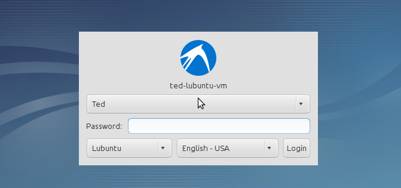
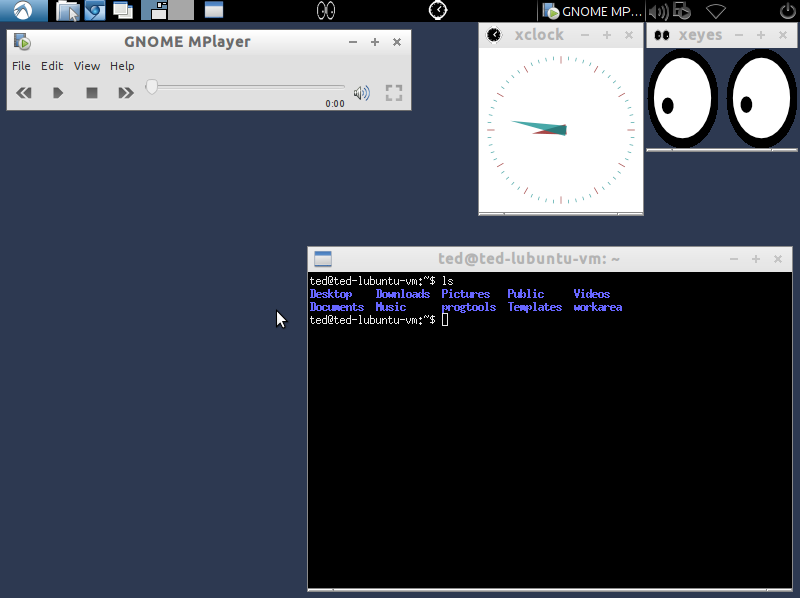
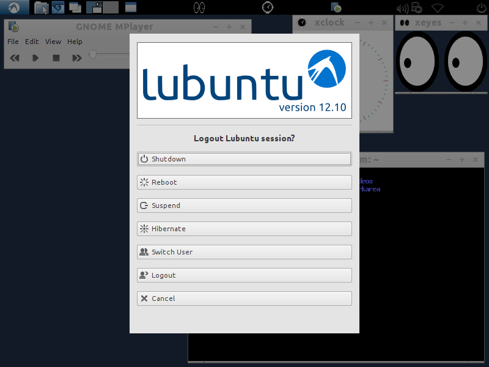

As a user, there is not much you need to know about the boot up. As soon you hit the power switch of the machine, a whole bunch of messages flies up to the screen. Linux is doing quite a bit behind the scenes but we don't need to concern ourselves about them right now.

Most modern Linux systems are configured to start a gui login prompt, this could either be the **xdm**, the X Display Manager or the **gdm**, the Gnome Display Manager. In the early days of Linux, the default login is a console prompt. Unless you setup Linux without a desktop manager, you will not see the console prompt for login. What you will see instead is a gui login.

During the installation, you were asked to create a user. You filled up, at the very least, 3 text fields, your name, a **username** and a **password**. You may not need to type up the username in the login prompt but you need to enter your password. 

Linux stop you cold in your tracks if you don't enter the correct password. The username that you provided during the setup will always be in lowercase but the password is different thing. The password allows for a mix of lower case, uppercase letters and numbers. It is important that you remember your password exactly as you defined it during setup because it is case sensitive. **Password** is different from **password**. 

After a successful login, you will now see a shiny graphical desktop interface, pretty much like what you would see on a Windows or a Mac system. You can launch applications, click things, surf the web, watch movies and send emails.

Shutting down is a lot easier than starting up. You can do this either by clicking the power button then select shutdown. Or you can press the keys **CTRL ALT DEL** simultaneously. 

## 1 Geek Version

BIOS/EFI

POST

GRUB

/sbin/init

init process tree

sysv init and runlevels

etc/inittab

etc/init.d/rcs

etc/rc5.d

etc/default

virtual console

.bashrc

shell

.login

halt -p now

## 2 Further Reading 

1. [The Linux Boot Sequence](http://www3.cs.stonybrook.edu/~prade/Teaching/Spring13/prez/L01/boot.pdf)
2. [Introduction to Linux, Section 2, TLDP.org](http://www.tldp.org/LDP/intro-linux/html/sect_02_01.html)

