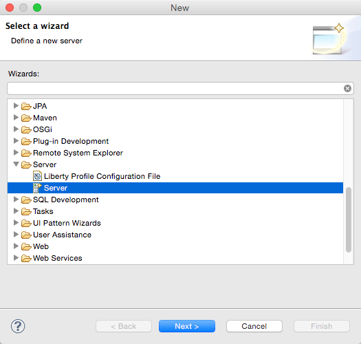
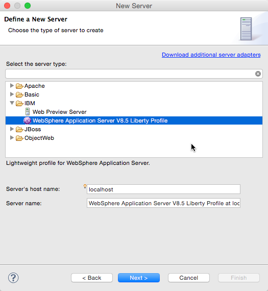
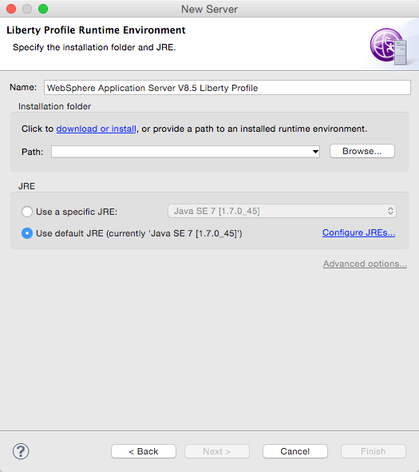
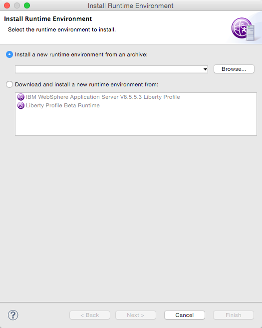
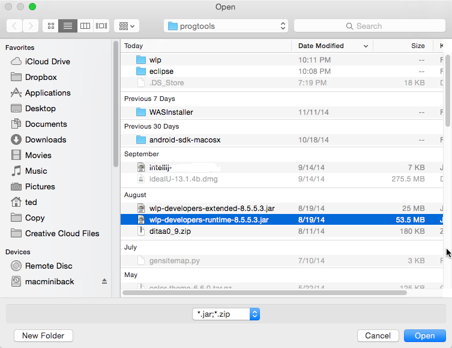
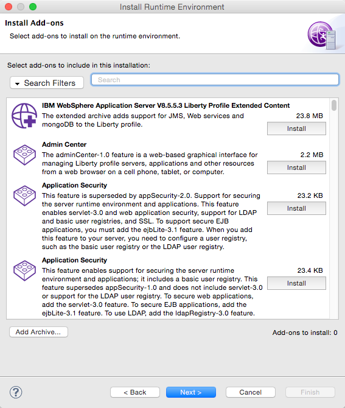
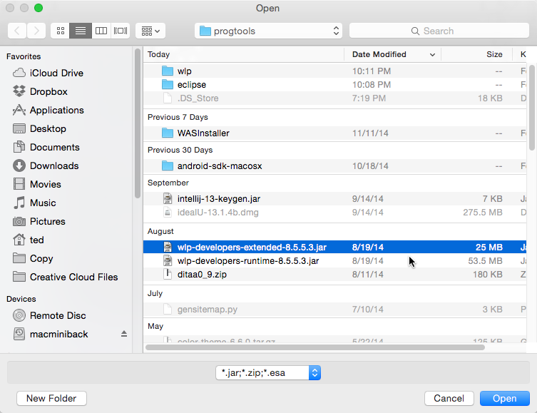
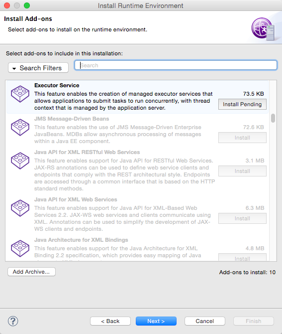
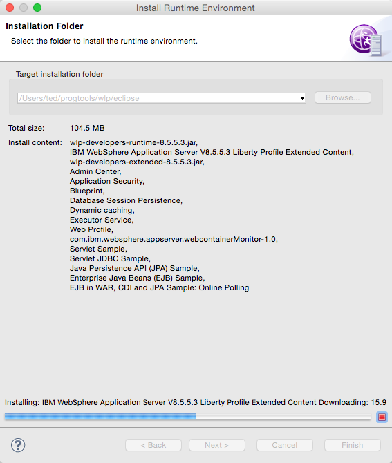

Launch Eclipse. On the menu, click  **File > Other**. This will take you to the selection wizard. Choose **Server**. Note, do not choose the Liberty Profile configuration option. That is not what we need

Define a new server. Choose **WebSphere Application Server Liberty Profile**. You need to provide the **Server's hostname** and a **Server name**. These have reasonable defaults anyway but you can change them if you like. 

The Server's hostname defaults to **localhost**, that is because most of the time, you will run the Liberty profile server on the same machine where you are running Eclipse. If you will test the Liberty profile serve from machine other than where you are running Eclipse, change the Server's hostname to a machine IP address or to a hostname that is resolvable within your local area network.

The Server name is just a label so you can easily identify it within Eclipse. Put what you want in it.

Set the **Runtime Environment**. It will ask you to give a name for Server again, this is essentially the same Server name in the dialog window, just acccept the default name.

There are two options for the Runtime Environment. You can either download a Runtime Environment or use one that you have already installed. We have already installed a Runtime Environment when we did the **Command Line installation** in the previous section.

If you choose to download a runtime, Eclipse will make a connection to the WAS Dev site and pull the runtime and extended jar files for the Liberty Profile. 

We will choose not to download the Runtime at this time. We will use our previously downloaded jar files for the Liberty profile runtime. Click **Browse**

Click the **Browse** button again.

The file you need is **wlp-developers-runtime-XX.XX.jar**. This was downloaded previously from the [WAS Dev site](https://developer.ibm.com/wasdev/). Choose the file then click the **Open** button

Notice the button on lower part of the screen that says **Add Archive ...**. Click that and choose the **wlp-extended-XX.XX.jar** we have downloaded earlier. 

You can choose the add-ons at this point. You can come back later to choose other add-ones so don't worry about your choices now. Click the **Next** button to proceed.

Finally you will choose the installation folder for the runtime environment. 

Click **Finish**

